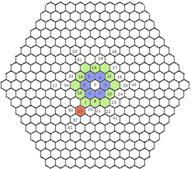
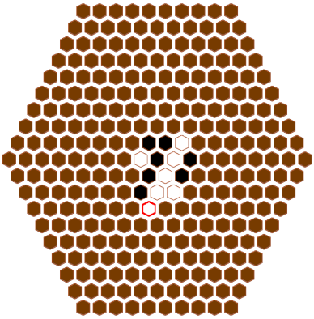
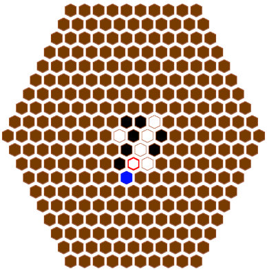

# Andantino

The goal of this project is to implement some search algorithms. 
The application follows the MVC (model-view-controller) design pattern. 
The packages are organized in such manner:

- src/Model: model of the application.
- src/Controller: controller of the application.
- src/View: view of the application.

## Model architecture description

The Model represents the core logic of the application, the relevant components
are:
- Model.HexTile: immutable, concrete class; it represents a tile placed by a
player in the gameboard.
- Model.AndantinoGameBoard : concrete class which represents the game-
board of Andantino. It is the component which interacts with the con-
troller. It contains two instances of two players and a list of objects of
type Model.Tile to constitute the gameboard.
- Model.SearchGameTree.AndantinoNode: concrete class; it is the node used
for a search tree. It contains a score for the current position.
- Model.TranspositionTable.AndantinoTranspositionTable: concrete class; it
is the transposition table used during the search.
- Model.TranspositionTable.AndantinoEntryInfo: concrete class it represents
an entry in the transposition table. It contains:
	* key: key of this entry.
	* score: value of the best position.
	* bestMove: Tile, which is the best move.
	* depth: depth at which the best move is found.
	* nodeType: flag used to indicate wether the score is an exact value or
	a lower bound or an upper bound.
- Model.BotPlayer : AI player of the application.
- Expert: package which contains the experts responsible for the evaluation
of a Node.
- Expert.BridgeExpert: concrete class; it evaluates a specified gameboard
configuration and returns a value based on the number of occurrences of
the Bridge feature[2]. The basic idea, behind this feature, is to create
three of your own pieces around an enemy tile, such that, the three pieces,
are all connected.
- Expert.RandomExpert: concrete class; it assigns a random value to im-
prove the result of the search.

## Tile indexing

An object of type HexTile represents a piece on the gameboard and contains
three fields of type int to store the axis of the object. Moreover, every tile
in the gameboard has an index associated with it. The index spans from zero
(inclusive) to 271 (inclusive), because the gameboard is a 10x10 with a total
of 271 tiles. The central tile (axis values: x = y = z = 0) has index equal to
zero. Then, starting from the south west neighbour the index is incremented
progressively by one in the first ring. The following image depicts the concept:

Figure 1: Internal representation of tiles’ indexes. The first ring is indicated in
blue, while green is used for the second.

## Transposition table

To improve the result of the search, the application uses a Transposition table.
A transposition is a re-occurrence of the same gameboard configuration during
a search. Therefore, to save resources, the application uses a table to save the
result of the search. It does so in the following manner:

- During a search a best move is found for a particular node (red bordered
tile, Figure 2(a)).
- Later, the same position is reached, Figure 2(b)). So, instead of keeping
searching, it retrieves the entry, from the transposition table, correspond-
ing to the current game configuration.

Figure 2a: Best move found.

Figure 2b: New search, same postions except for
the last placed tile. The best move is the
blue tile.

To store a best move for a position, the system uses the concepts from
Zobrist [3]. The idea is that the table contains a matrix of 2x271 elements, 2
is the number of players and 271 is the number of positions in the gameboard.
Every position in the gameboard has a unique index, as explained in 2.1.1, which
is used to access the table as the column value (this is the reason for starting
to count from zero in the gameboard’s tiles). Thanks to this, it is guaranteed
random-access to the table’s entries. Then, to store a best move in the table
the following steps are applied:

- Retrieve the index of each position in the current game configuration.
- Access each corresponding entry and obtain the key.
- Xor all fetched values between each other to obtain a value ”V ”.
- Determine the hash of ”V ”, which uses the modulus operator by doing
”V ” % 272 = ”C ”.
- Store in table[color][”C ”] the best move.

Then, if during the search the same game configuration occurs again, the table
is accessed with entry equals to table[color][C ], where ”C ” is the result of the
xor of all the tiles of the current node.

## References

1) T.A. Marsland. A review of game-tree pruning, 1986

2) A. Reinefeld. An improvement of the scout tree-search algorithm. ICCA
Journal, 1983

3) Albert L. Zobrist. A new hashing method with application for game playing,
April 1970